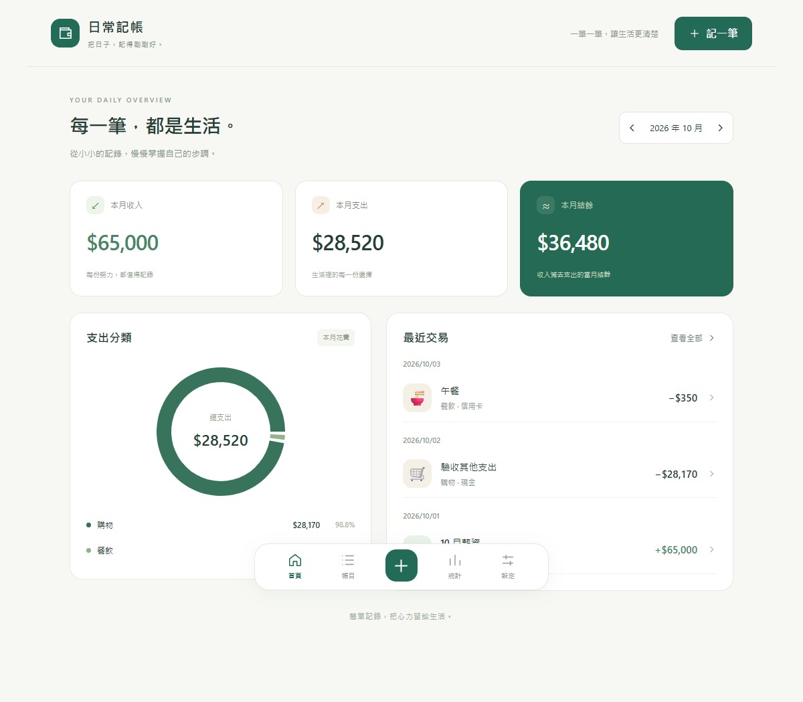

# 日常記帳

手機優先的個人記帳 App，以 .NET 8、React、TypeScript 與 SQLite 開發。

支援收入／支出新增、修改與刪除、分類與帳戶管理、每月收支摘要、分類比例、六個月趨勢及 PWA。



## 快速開始

專案程式碼位於 `SimpleExpenseTracker/`。以下兩種啟動方式擇一使用，命令皆從 repository 根目錄開始。

### Docker Compose

需要 Docker Engine／Docker Desktop（Linux 容器）與 Compose v2：

```sh
cd SimpleExpenseTracker
docker compose up -d --build
```

開啟 [http://localhost:5080](http://localhost:5080)，亦可使用 [http://localhost:8080](http://localhost:8080)。前後端已整合，SQLite 儲存在具名 volume。

Dockerfile、Compose 與 .dockerignore 已納入儲存庫，可在 clone 後使用上述命令。容器建置／啟動尚未實際驗證；既有測試結果來自原生 .NET／Node.js 環境。

### 本機開發

需要 .NET 8 SDK、Node.js 22 以上及 pnpm 11。

```sh
cd SimpleExpenseTracker
dotnet restore
dotnet run --project backend/SimpleExpenseTracker.Api --urls http://127.0.0.1:5080
```

另開 Terminal，從 repository 根目錄執行：

```sh
cd SimpleExpenseTracker/frontend/simple-expense-tracker-web
pnpm install --frozen-lockfile
pnpm dev
```

開啟 [http://127.0.0.1:5173](http://127.0.0.1:5173)。Docker 與本機後端都使用 5080，請擇一啟動。

## 文件

- [開發規格書](SimpleExpenseTracker/docs/SPECIFICATION.md)：原始完整規格，包含資料模型、API、開發階段與 MVP 驗收條件。
- [完整啟動、Docker、資料備份、PWA 發佈與 API 說明](SimpleExpenseTracker/README.md)
- [驗收紀錄](SimpleExpenseTracker/docs/VALIDATION.md)：既有紀錄為 15 個後端、7 個前端測試通過。

目前沒有登入驗證或雲端同步；PWA 安裝後仍需連線至後端才能存取帳目。
