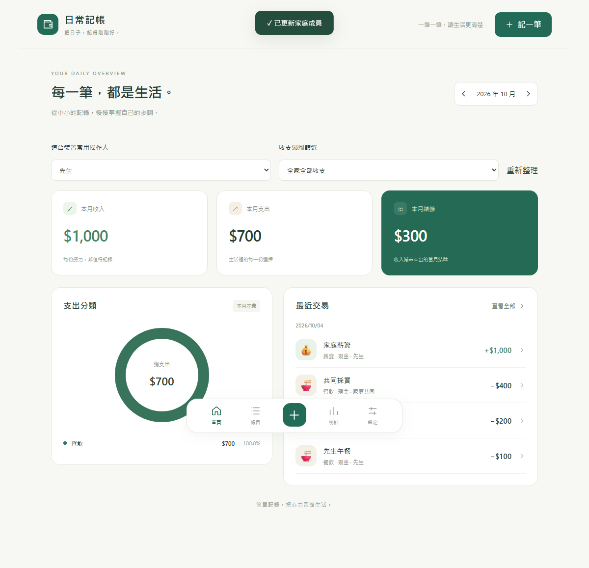

# 日常記帳

手機優先的家庭共同記帳 App，以 .NET 8、React、TypeScript 與 SQLite 開發。家人連到同一個後端即可共用一本帳，全部收入與支出彼此公開。

支援收入／支出新增、修改、確認刪除與復原、分類與帳戶管理、每月收支摘要、分類比例、六個月趨勢及 PWA。



[家庭版手機首頁](SimpleExpenseTracker/docs/screenshots/family-mobile.png)

## 主要功能

- **家庭共同帳本**：管理成員，標記個人或家庭共同收支，依歸屬篩選帳目與統計；共同金額只計算一次。
- **日常記帳**：依日期分組、月份與收支類型篩選、分頁，以及交易建立與最後操作紀錄。
- **安全更新帳目**：版本檢查避免同時修改互相覆蓋，新增重試使用同一識別碼避免重複入帳；已刪除帳目可復原。
- **分類與帳戶**：新增、修改、停用及分類排序，保留歷史帳目關聯。
- **收支統計**：所選月份的收入、支出、結餘與支出分類圖；六個月趨勢以伺服器目前月份為基準。
- **手機優先 PWA**：響應式畫面、主畫面安裝資源與程式外殼快取。
- **固定收支**：每週／每月／每年與每 N 期排程、固定或浮動金額、啟用停用、補產生帳目與月年預估，詳見[操作文件](SimpleExpenseTracker/docs/RECURRING.md)。
- **完整備份與還原**：設定頁下載 SQLite 備份、上傳預覽及整本還原，還原前自動保存原帳本；任何人都可操作，無管理密碼。

目前沒有登入驗證、私人帳目、雲端同步或帳戶餘額計算。「操作人」是自行選擇的紀錄標記，任何能連到服務的人都能查看與修改帳目。資料保存在後端 SQLite；PWA 安裝後仍需連線至後端，離線不接受或排程記帳。

## 快速開始

專案程式碼位於 `SimpleExpenseTracker/`。以下兩種啟動方式擇一使用，命令皆從 repository 根目錄開始。

### Docker Compose

需要 Docker Engine／Docker Desktop（Linux 容器）與 Compose v2：

```sh
cd SimpleExpenseTracker
docker compose up -d --build
```

開啟 [http://localhost:5080](http://localhost:5080)，亦可使用 [http://localhost:8080](http://localhost:8080)。前後端已整合，SQLite 儲存在具名 volume。

Dockerfile、Compose 與 .dockerignore 已納入儲存庫，可在 clone 後使用上述命令。容器建置／啟動尚未實際驗證；既有測試結果來自原生 .NET／Node.js 環境。

### 更新既有容器

在部署機器的 repository 根目錄執行：

```sh
git pull --ff-only origin main
cd SimpleExpenseTracker
docker compose up -d --build
```

沿用原本 Compose 專案名稱與 `expense-data` volume，更新後關閉舊 App 分頁／PWA 視窗再重新開啟。停止服務時不要使用 `docker compose down -v`，以免刪除帳本與自動備份。

### 本機開發

需要 .NET 8 SDK、Node.js 22 以上及 pnpm 11。

```sh
cd SimpleExpenseTracker
dotnet restore
dotnet run --project backend/SimpleExpenseTracker.Api --urls http://127.0.0.1:5080
```

另開 Terminal，從 repository 根目錄執行：

```sh
cd SimpleExpenseTracker/frontend/simple-expense-tracker-web
pnpm install --frozen-lockfile
pnpm dev
```

開啟 [http://127.0.0.1:5173](http://127.0.0.1:5173)。Docker 與本機後端都使用 5080，請擇一啟動。

### 家庭初次使用

1. 到「設定 → 家庭成員」修改預設的「成員一／成員二」。
2. 每台裝置選擇自己的「這台裝置常用操作人」，選擇儲存在該瀏覽器，不會同步到其他裝置。
3. 新增交易時選擇收支歸屬，可指定成員或「家庭共同」；修改、刪除與復原也需選擇操作人。

兩支手機必須連到同一個後端與資料庫。上述 `localhost`／`127.0.0.1` 網址供電腦本機使用；手機需使用可連到該電腦的服務網址。手機安裝 PWA 需受信任的 HTTPS，部署與資料備份方式見[完整 README](SimpleExpenseTracker/README.md)。

從個人版升級時，既有帳目保留並顯示「歸屬待確認」，可逐筆編輯補上歸屬。升級前先停止服務並備份 SQLite 資料庫及存在的 WAL／SHM 檔案。

## 資料備份與還原

開啟「設定 → 資料備份與還原」，任何人都可操作，不需要管理密碼或選擇操作人。

1. **匯出**：按「匯出完整備份」，確認瀏覽器已保存 `.db` 檔。包含全部交易、已刪除帳目、分類、帳戶、成員與操作紀錄。
2. **匯入**：選擇目前版本或已知舊版匯出的 SQLite 備份（最多 100 MB），檢視資料摘要，再輸入「還原」確認。
3. **還原**：取代目前整本帳，不合併資料；系統先自動備份原帳本，正常保留最近 5 份並提供下載。

還原期間暫停帳目操作，成功後需重新整理其他裝置的頁面。自動備份位於同一個 Docker volume，請另存下載檔到其他裝置；裝置常用操作人不包含在備份內。詳細的相容性、失敗恢復與 API 說明見[備份文件](SimpleExpenseTracker/docs/BACKUP.md)。

## 驗證狀態

依 [2026/10/04 驗收紀錄](SimpleExpenseTracker/docs/VALIDATION.md)：

- 最新固定收支與舊備份相容版本：46 個後端測試、17 個前端測試通過，前後端建置成功；完整還原、WAL 備份、重啟恢復與舊頁面防誤寫已驗證。
- 家庭版既有雙裝置驗收包含並行修改、重試防重複、刪除復原與舊資料升級；375×667、390×844、412×915 與 1200×900 的主要畫面無水平溢位。
- 最新版 Release 發佈成功；既有家庭版驗收曾遭本機 Windows 應用程式控制封鎖 Release DLL，瀏覽器驗收使用 Debug 整合版。
- 備份上傳／還原已通過 HTTP 整合與前端互動測試，瀏覽器完整檔案下載／選擇流程尚未完成驗證。
- 使用者目前以容器運行；本次開發環境沒有 Docker CLI，尚未重建驗證新版容器。實體手機主畫面安裝亦未實際驗證。

## 文件

- [家庭共同記帳](SimpleExpenseTracker/docs/FAMILY.md)：目前家庭版的使用方式、共同操作規則與資料庫升級說明。
- [資料備份與還原](SimpleExpenseTracker/docs/BACKUP.md)：匯出、匯入、自動備份、容器更新及 API 說明。
- [開發規格書](SimpleExpenseTracker/docs/SPECIFICATION.md)：保留原始個人版規格，家庭功能以增補文件與目前實作為準。
- [完整啟動、Docker、資料備份、PWA 發佈與 API 說明](SimpleExpenseTracker/README.md)
- [驗收紀錄](SimpleExpenseTracker/docs/VALIDATION.md)：備份功能、家庭版與原始 MVP 的測試結果及驗證限制。
